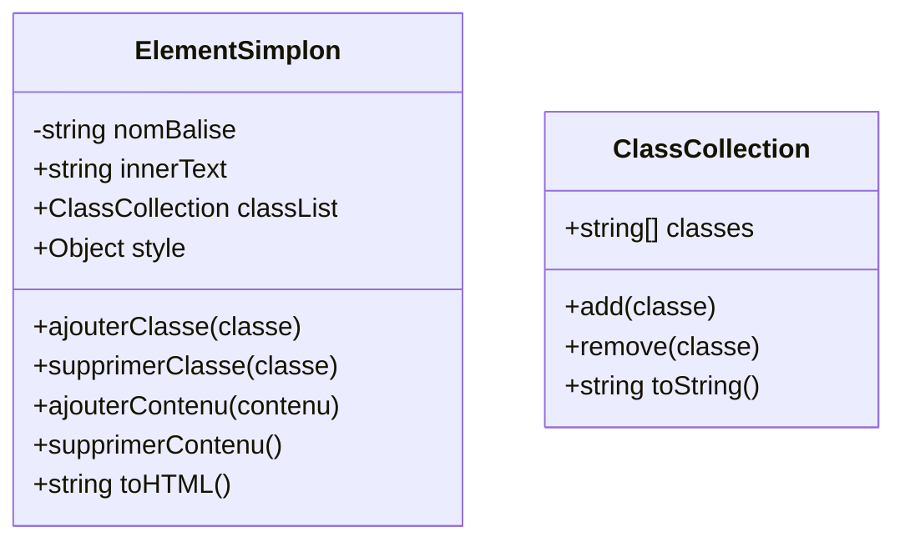

# TP - DOM HTML

Nous allons créer un class ElementSimplon qui va nous permettre
créer et manipuler des éléments HTML

Analysons ce qu'est un élément HTML

## Un élément HTML

Un élément HTML possède un type de balise
il possède des classes CSS
un contenu (innerText)
du style

à la manière de ce code :

```ts
const box = document.createElement("div")
box.classList.add("boite")
box.innerText = "Yo yo tout le monde"
box.style.width = "100%"
```

Il peut se transformer en code HTML

```html
<div class="boite" style="width: 100%">Yo yo tout le monde</div>
```

et être ajouté à un autre élément

```ts
const container = document.createElement("div")
container.classList.add("container")
container.appendChild(box)
```

## Diagramme de classe



## Consignes

Créer et implémentez les classes nécessaires à la résolution des problèmes suivants :

1. Créer un élément HTML de type div avec la classe "container" et le contenu "Hello World" ==> <div class="container" >Hello World</div>
2. Afficher dans la console le code HTML de cet élément
3. Créer un élément HTML de type h1 avec la classe "title" et le contenu "Mon titre" avec le texte en couleur rouge
4. Afficher dans la console le code HTML de cet élément
5. Ajouter une méthode appendChild pour rajouter le titre créé précédemment dans une balise div de classe "container"
